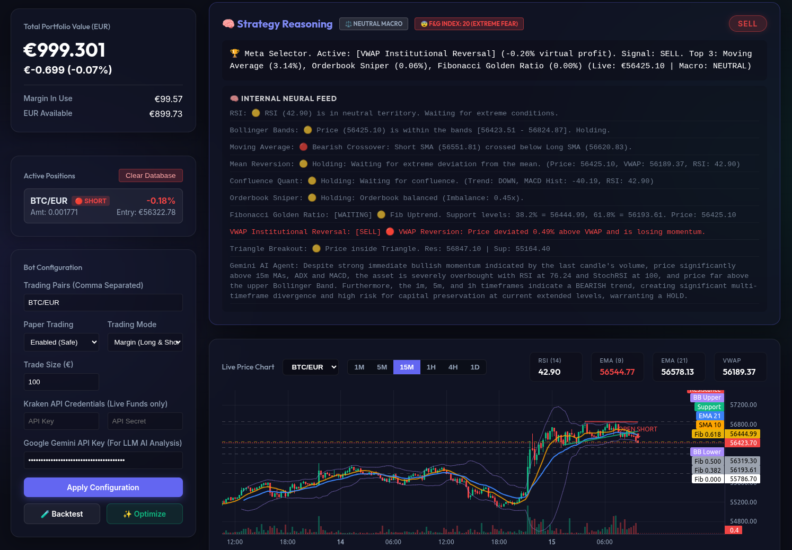

# DekkBot 🤖📈

DekkBot is a highly advanced, fully automated algorithmic Crypto Trading Bot designed for high-performance trading on the Kraken exchange. It features a state-of-the-art **Meta-Strategy Selector**, an integrated **Google Gemini AI Agent**, and a beautiful React-based dashboard for real-time monitoring and configuration.



## 🌟 Key Features

*   **Meta-Strategy Selector**: Instead of relying on a single fixed strategy, DekkBot runs up to 10 distinct trading strategies simultaneously in the background. It tracks the "virtual profit" of each strategy in real-time and dynamically selects the best-performing algorithm to execute live trades.
*   **Google Gemini AI Agent**: Integrates Google's advanced LLM (Gemini 2.5 Flash) to analyze the market. It feeds the AI a "Multi-Timeframe Confluence Matrix" (1m, 5m, 15m, 1h, 4h, 1d), orderbook depth, and current technical indicators. The AI then reasons about market sentiment and provides actionable signals.
*   **Internal Neural Feed**: Live monitoring of multiple technical strategies including:
    *   VWAP Institutional Reversal
    *   Confluence Quant
    *   Orderbook Sniper
    *   Fibonacci Golden Ratio
    *   Triangle Breakout (using a dynamic ZigZag Structural Pivot algorithm)
    *   Bollinger Bands & Mean Reversion
    *   Moving Average Crossovers
*   **Beautiful UI / Dashboard**: A sleek, dark-mode React application built with Vite. It features real-time charts (via TradingView Lightweight Charts) that plot your entries, exits, trendlines, and indicators live.
*   **Paper Trading & Live Trading**: Safely test the waters with simulated paper trading (margin long & short support), or plug in your Kraken API credentials to trade live funds.
*   **Advanced Risk Management**: Includes Auto-DCA (Dollar Cost Averaging), Trailing Stops, Breakeven Stops, and Kelly Criterion dynamic position sizing.

## 🚀 Getting Started

### Prerequisites
*   Node.js (v16 or higher)
*   A Kraken account (for live trading)
*   A Google Gemini API Key (for the AI Agent)

### Installation

1.  **Clone the repository:**
    ```bash
    git clone git@github.com:Hoaxr/DekkBot.git
    cd DekkBot
    ```

2.  **Install Backend Dependencies:**
    ```bash
    cd backend
    npm install
    ```

3.  **Install Frontend Dependencies:**
    ```bash
    cd ../frontend
    npm install
    ```

### Running the Bot

You need to run both the backend server and the frontend dashboard.

**Start the Backend:**
```bash
cd backend
npm start
```
*(The backend runs on http://localhost:3000)*

**Start the Frontend:**
```bash
cd frontend
npm run dev
```
*(The frontend will be available at http://localhost:5173)*

## ⚙️ Configuration
All configuration can be done directly from the UI dashboard:
1.  Enter your **Trading Pair** (e.g., `BTC/EUR`).
2.  Set your **Trade Size** and choose between **Paper Trading** or **Live Trading**.
3.  Paste your **Kraken API Key & Secret** (only required for Live Trading).
4.  Paste your **Google Gemini API Key** to enable the AI Agent.
5.  Click **Apply Configuration** and **Start Bot**.

## 🧠 The Meta-Strategy
The true power of DekkBot lies in its Meta-Strategy. It constantly evaluates the market context (Bullish, Bearish, or Neutral Macro trends) combined with the Fear & Greed Index. It then looks at the virtual PNL of all sub-strategies. If the VWAP Reversal strategy is currently dominating the market, the Meta Selector will seamlessly switch to it, ensuring the bot always uses the most optimal approach for the current market conditions.

---
*Disclaimer: Cryptocurrency trading is highly volatile and carries a high level of risk. This software is provided for educational purposes only. Do not trade with money you cannot afford to lose.*
